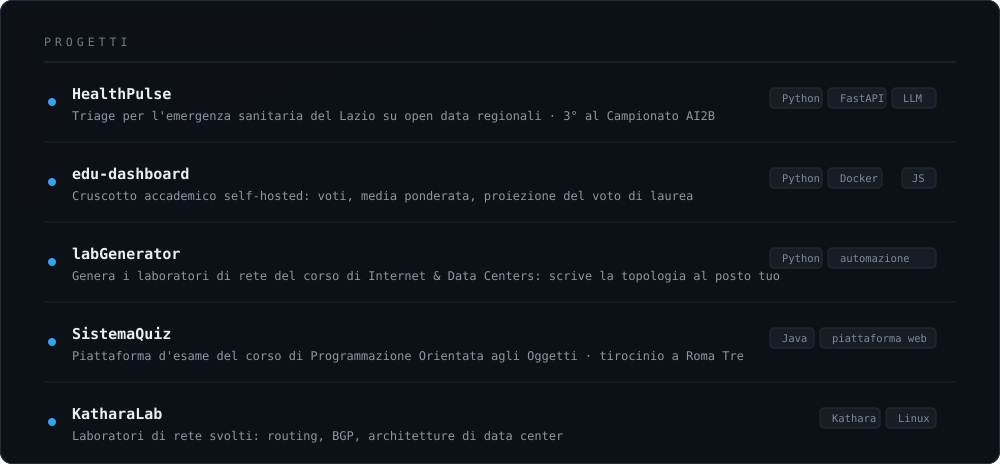

<picture>
  <source media="(prefers-color-scheme: dark)" srcset="assets/header-dark.svg">
  <source media="(prefers-color-scheme: light)" srcset="assets/header-light.svg">
  
</picture>

  
  &nbsp;
  
  &nbsp;
  
  &nbsp;
  

 

Sto chiudendo la magistrale in Ingegneria Informatica a Roma Tre, curriculum Sistemi Informatici Complessi.

Mi interessa il sistema per intero: la pipeline che elabora i dati, il servizio che li espone, la macchina su cui gira e il backup che lo rimette in piedi quando si rompe. Lavoro su infrastruttura Linux, servizi containerizzati e modelli linguistici eseguiti in locale, e quello che costruisco lo tengo acceso abbastanza a lungo da vederlo rompersi — che è il momento in cui si impara qualcosa.

 

<picture>
  <source media="(prefers-color-scheme: dark)" srcset="assets/progetti-dark.svg">
  <source media="(prefers-color-scheme: light)" srcset="assets/progetti-light.svg">
  
</picture>

  <a href="https://github.com/MatteoTomassetti25/HealthPulse-AI2B">HealthPulse-AI2B</a> &nbsp;·&nbsp;
  <a href="https://github.com/MatteoTomassetti25/edu-dashboard">edu-dashboard</a> &nbsp;·&nbsp;
  <a href="https://github.com/MatteoTomassetti25/labGenerator">labGenerator</a> &nbsp;·&nbsp;
  <a href="https://github.com/MatteoTomassetti25/SistemaQuizMatteo">SistemaQuizMatteo</a> &nbsp;·&nbsp;
  <a href="https://github.com/MatteoTomassetti25/KatharaLab">KatharaLab</a>

 

## Stack

<table>
<tr>
<td width="150"><b>Linguaggi</b></td>
<td>

</td>
</tr>
<tr>
<td><b>AI e dati</b></td>
<td>

</td>
</tr>
<tr>
<td><b>Backend e web</b></td>
<td>

</td>
</tr>
<tr>
<td><b>Infrastruttura</b></td>
<td>

</td>
</tr>
</table>

 

## Studi

**Laurea Magistrale in Ingegneria Informatica (LM-32)** — Roma Tre, curriculum Sistemi Informatici Complessi, in corso 
Machine learning e deep learning · reti e data center · architettura del software · sistemi operativi e programmazione di sistema in C · cybersecurity ed ethical hacking · GDPR e AI Act

**Laurea in Ingegneria Informatica (L-8)** — Roma Tre, 2025

 

---

  Se qualcosa qui ti serve, aprine una issue o scrivimi. Rispondo.

